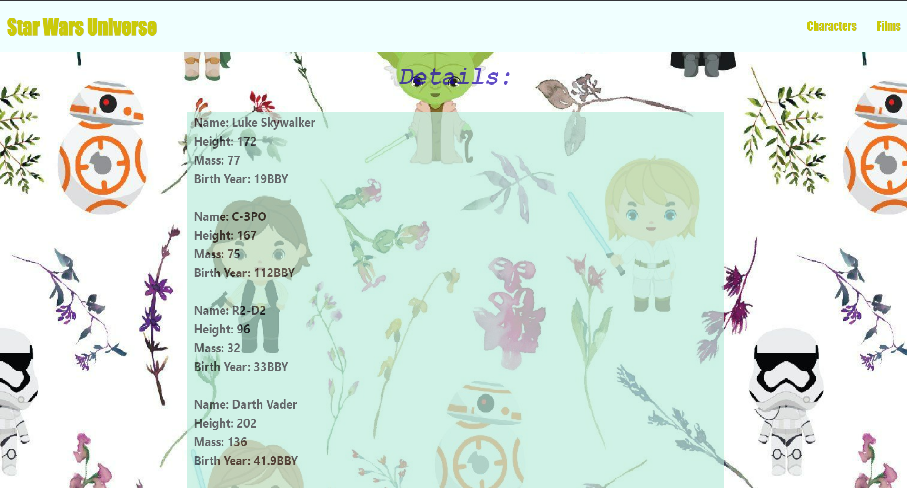

# star-wars-API

## **Description**
### The task was to create a basic webpage displaying items from the Star Wars API

### The screenshot of the application is presented below.

## **Credits**
- https://swapi.dev/api
- https://www.stackoverflow.com/
- https://www.w3schools.com/

## **Deployment**
### The website has been deployed on GitHub as 
https://elenamagay.github.io/star-wars-API

#### Languages
 

